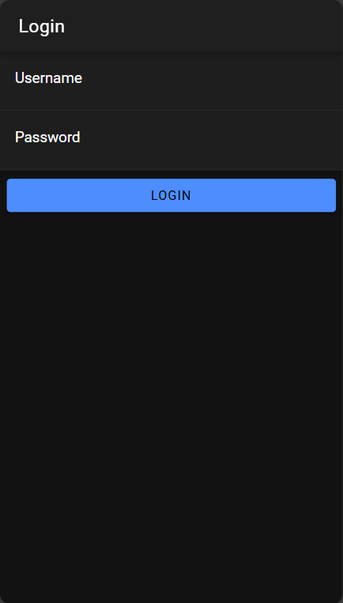
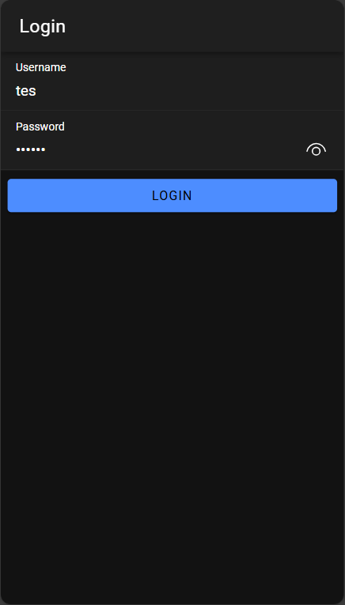
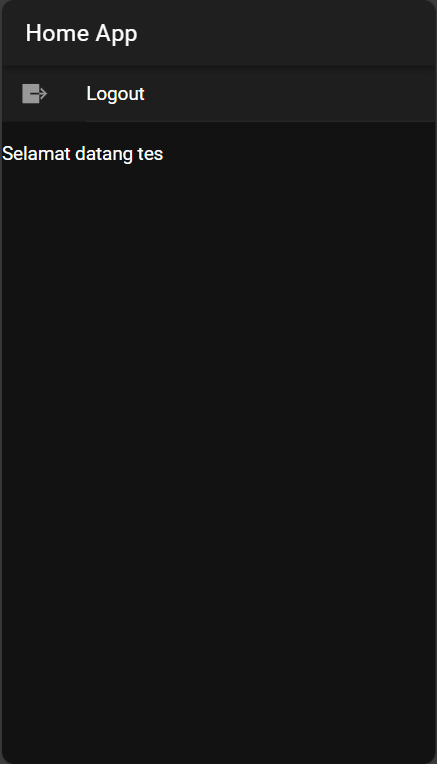

# Tugas 7 - Pertemuan 8

- **Nama** : Arya Galuh Saputra
- **NIM** : H1D022022
- **Shift Lama** : C
- **Shift Baru** : B

## Cara Kerja Login

### 1. Database
```sql
CREATE TABLE user (
    username varchar(100) NOT NULL,
    password varchar(255) NOT NULL
);
```

### 2. API (PHP)
- File `koneksi.php`: Menyediakan koneksi ke database
- File `login.php`: Memvalidasi username dan password, serta memberikan token jika autentikasi berhasil

### 3. Komponen Ionic
- `authentication.service.ts`: Menangani proses autentikasi login
- `auth.guard.ts`: Melindungi halaman-halaman yang membutuhkan akses login
- `auto-login.guard.ts`: Memverifikasi status login secara otomatis

### 4. Alur Login
1. Pengguna memasukkan username dan password
2. Informasi dikirim ke API PHP
3. API memeriksa data di database
4. Jika verifikasi berhasil:
   - Pengguna menerima token
   - Informasi disimpan di localStorage
   - Pengguna diarahkan ke halaman utama (Home)
5. Jika verifikasi gagal:
   - Pesan kesalahan ditampilkan
   - Pengguna tetap berada di halaman login

## Cara Pasang

1. Membuat project baru:
```bash
ionic start cobalogin
cd cobalogin
```

2. Instalasi paket tambahan:
```bash
npm i @capacitor/preferences
```

3. Buat komponen:
```bash
ionic g service services/authentication
ionic g page login
ionic g guard guards/auth --implements CanActivate
ionic g guard guards/autoLogin --implements CanActivate
```

4. Konfigurasi database & API:
- Buat database sesuai dengan struktur yang diberikan
- Tempatkan file PHP pada direktori web server
- Sesuaikan URL API di authentication.service.ts

## Screenshot

### Halaman Login



### Halaman Home
